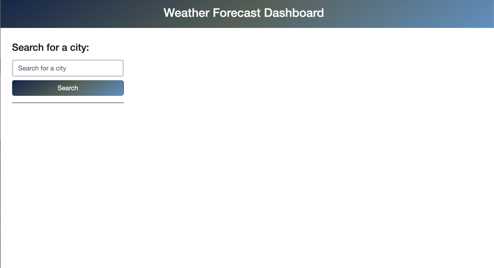

# 5 Day Weather Forecast Dashboard

## Description

This website provides a convienient way to get weather information (temperature, wind speed and humidity) over the next 5 days for any city in the world. The website also keeps local storage of your search history to make going back to your past searches much easier. It can store weather information for multiple cities, saving your windows tab space.

## Installation

N/A

## Usage

Here is the link to the working website: https://wytseng.github.io/weather-forecast-dashboard/ 

(*note, this site may stop working after 1/19/2038 at 3:14:07)

The home page is very minimalistic. It only shows a search bar along with a search button, prompting users to enter a city name. 

When an incorrect city name is entered, a window alert will notify the user and allow them to continue entering a city name until the page can find one matching the input. 

Once an existing city is found, a dashboard will appear to the right of the search bar. The top section of the dashboard displays the current weather, while the bottom section displays the weather forecast for the next 5 days. 

Provide instructions and examples for use. Include screenshots as needed.

To add a screenshot, create an `assets/images` folder in your repository and upload your screenshot to it. Then, using the relative filepath, add it to your README using the following syntax:

    ```md
    
    ```

## Credits

Third-party APIs: 

- OpenWeather API - [https://openweathermap.org/api](https://openweathermap.org/api)
- Day.js API - [https://day.js.org/en/](https://day.js.org/en/)

## License

MIT License

## Tests

Go the extra mile and write tests for your application