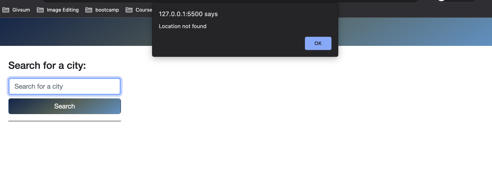
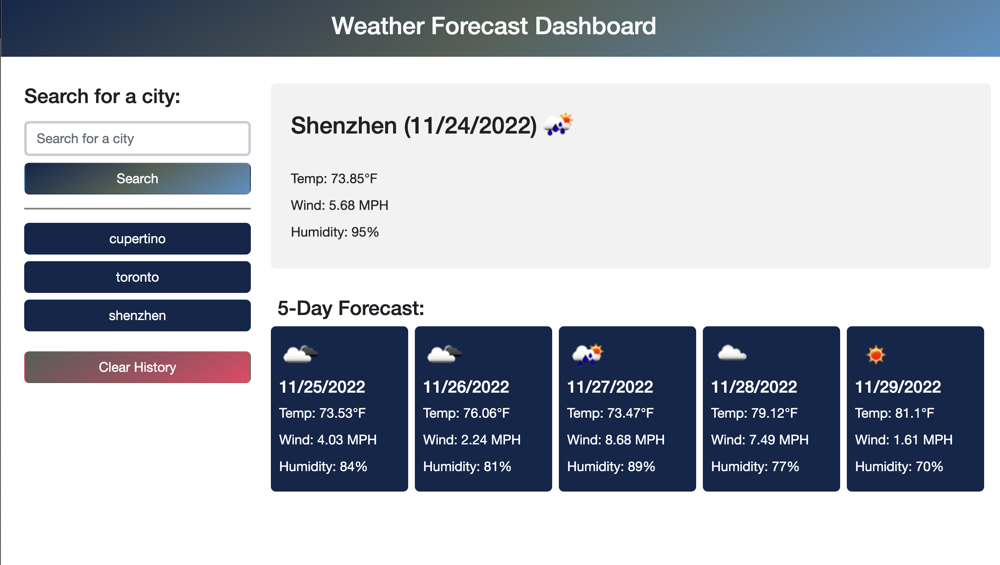

# 5 Day Weather Forecast Dashboard

## Description

This website provides a convienient way to get weather information (temperature, wind speed and humidity) over the next 5 days for any city in the world. The website also keeps local storage of your search history to make going back to your past searches much easier. It can store weather information for multiple cities, saving your windows tab space.

## Installation

N/A

## Usage

Here is the link to the working website: https://wytseng.github.io/weather-forecast-dashboard/ 

(*note, this site may stop working after 1/19/2038 at 3:14:07)

The home page is very minimalistic. It only shows a search bar along with a search button, prompting users to enter a city name. 

When an incorrect city name is entered, a window alert will notify the user and allow them to continue entering a city name until the page can find one matching the input. 

Once an existing city is found, a dashboard will appear to the right of the search bar. The top section of the dashboard displays the current weather, while the bottom section displays the weather forecast for the next 5 days. Forecasts for each day includes information on the date, temperature, wind speed, humidity, along with a little weather icon to visualize the overall weather. 

Additionally, note that all the succesfully search histories are display underneath the search bar along with a clear history button. Clicking on a search history will update the dashboard accordingly. The search history will stay on the site after refresh. Meawhile, clicking on the "clear history" button will clear you search history, removing all the content below the search bar. 

Forecast data: the displayed forecast is based on the noon (12:00) forecast for each day, with exceptions to the current and last day forecast. The current day forecast uses the weather forecast closes to current time. Likewise, if the noon forecast hasn't been released for the last day, the last forecast (most distanced in time) will be used instead. 

## Credits

Third-party APIs: 

- OpenWeather API - [https://openweathermap.org/api](https://openweathermap.org/api)
- Day.js API - [https://day.js.org/en/](https://day.js.org/en/)

## License

MIT License
